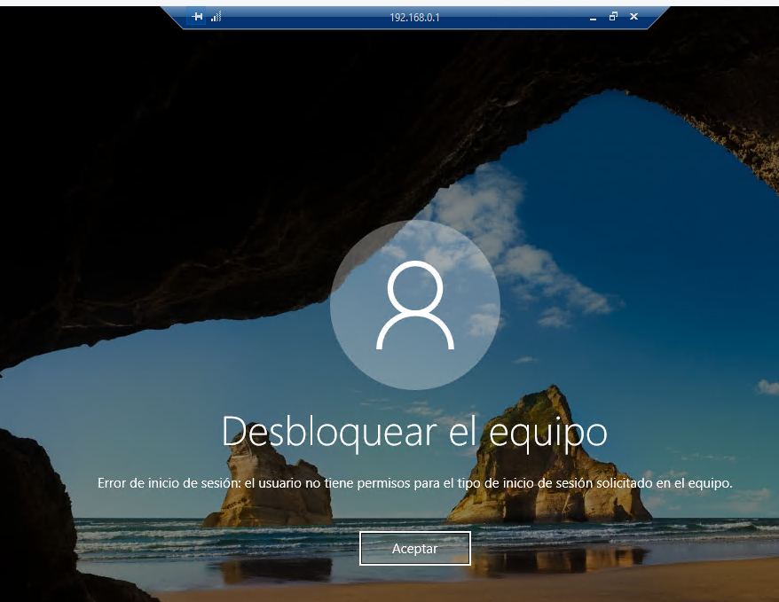
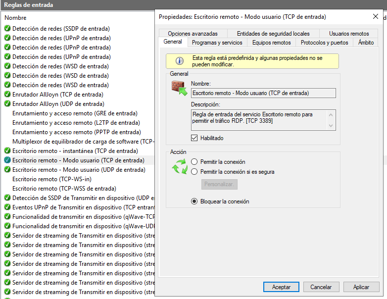
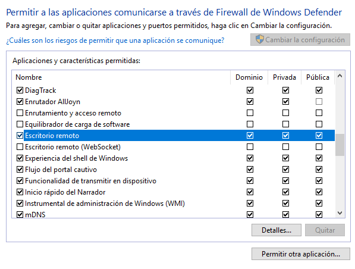
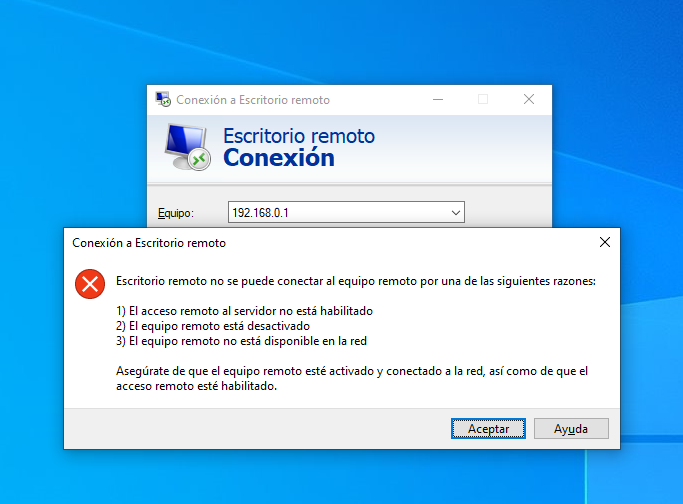

# AUTORITZACIÓ DE L'ACCÉS REMOT

Des d'un client ( Windows 10 Pro ) creem una Connexió Remota amb el Servidor. Necessitareu:
1.  Que el servidor tinga habilitat l'accés remot.
2.  Que l'usuari en concret estiga habilitat per usar-lo.
3.  Que el Firewall no ho impedisca.
    3.1  Regla d'entrada bloquejant el protocol
    3.2  Desautorització de l'aplicació de *Escritorio remoto*
   

## 1.  Habilitar el accés de remot al servidor

</img>

Podem comprovar-ho també excutant des del cmd el **sconfig**

</img>

## 2. Modificació de la GPO Default Domain Policy

Obrim la consola d'Administració de Directives de Grup.
Des de l'Administrador de Servidor o excutant **gpmc.msc**

</img>

Editem la Directiva del Domini per Defecte (Default Domain Police).

</img>

Es tracta donar a l'usuari el dret de inciar sessió de forma remota.

</img>

Devem observar el valor per defecte en la pestanya "Explicación". En este cas només podien iniciar sessió d'escriptori remot en el servidor els Administradors de domini.

</img>

</img>

>**Note**
>Recordeu executar el **gpupdate /force**
>En cas contrari no ens permetrà l'autenticació


```
gpupdate /force
```

### Usuario NO auorizado

Si l'usuari no està autoritzat com hem vist ( o no hem executat el gpupdate ) tindrem este error:


</img>
## 3.  FIREWALL

Revisem les restriccions possibles del FireWall. 
*  Regles entrants.
*  Aplicacions permeses.

## 3.1  
</img>

## 3.2

</img>

Vegem el **bloqueig pel Firewall** del servidor mitjançant una regla d'entrada.

### Bloqueig per Regla de Entrada al protocol

</img>

### Bloqueig a l'aplicació "Escritorio remoto"

</img>

</img>

## 4. Accès des del client correcte


</img>

</img>
</img>


