# ACCÉS REMOT

Des d'un client ( Windows 10 Pro ) creem una Connexió Remota amb el Servidor. Necessitareu:
* Que el servidor tinga habilitat l'accés remot.
* Que l'usuari en concret estiga habilitat per usar-lo.
* Que el Firewall no tinga cap regla impedint-ho.


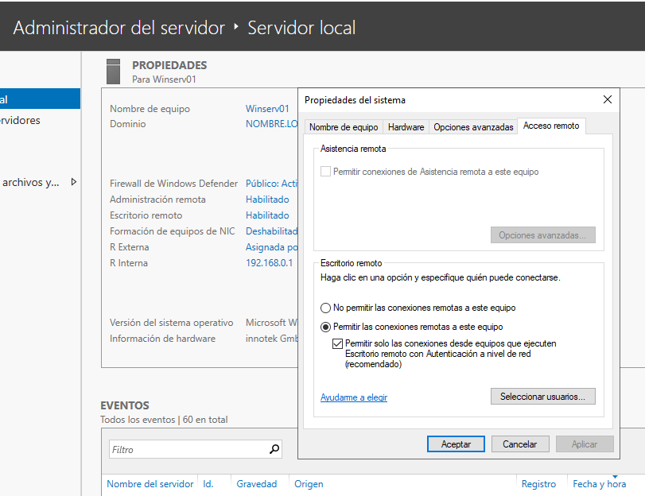</img>


## Modificació de la GPO Default Domain Policy

Si volem iniciar sessió remota al servidor amb un usuari que no és Administrador, ho haurem de configurar, evidentment, per defecte ve inhabilitat.


</img>


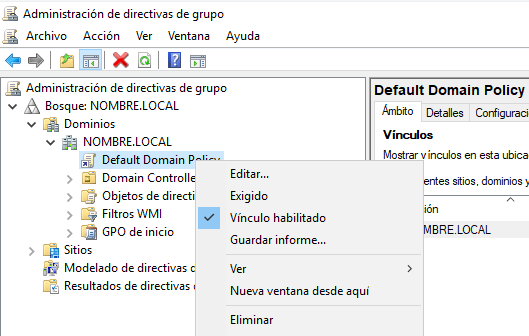</img>
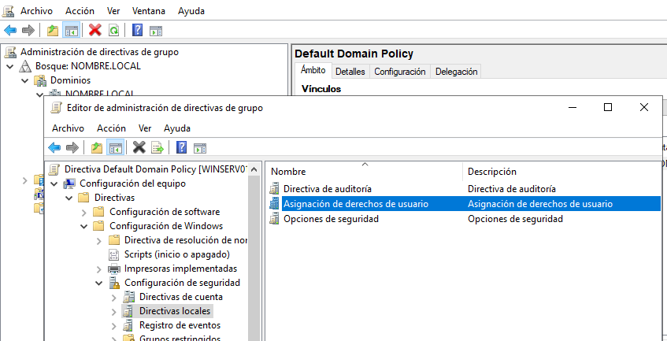</img>

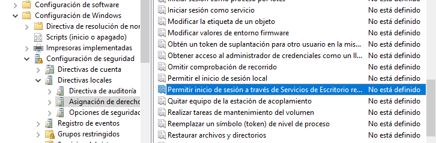</img>
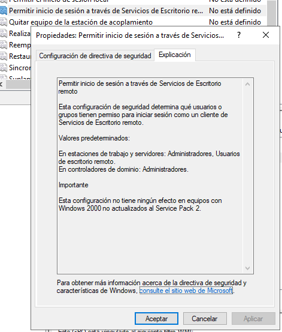</img>
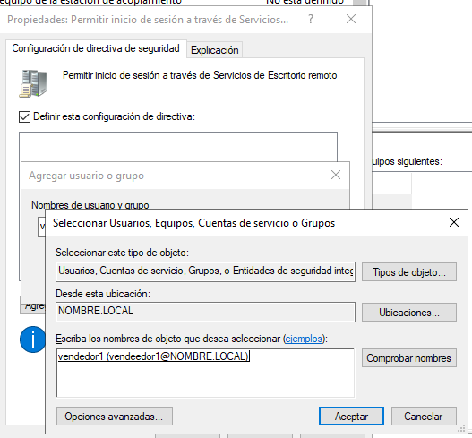</img>

:NOTA: Recordeu executar el gpupdate /force
```
gpupdate /force
```


## Accès des del client

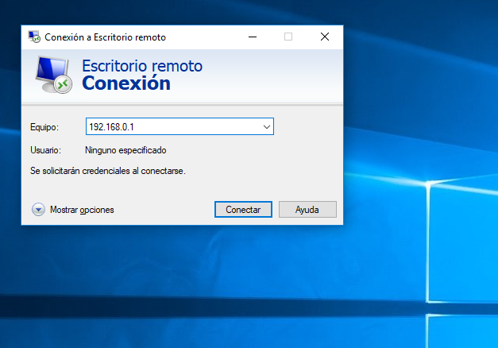</img>

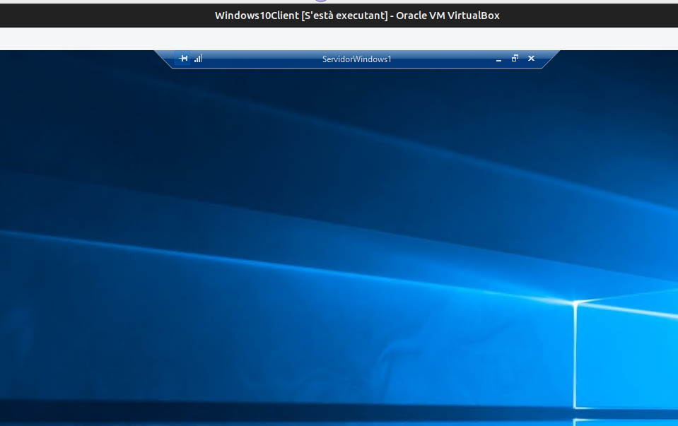</img>
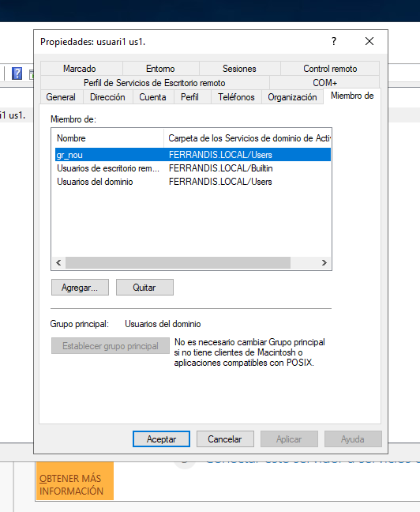</img>

## Firewall
Revisem les restriccions possibles del FireWall. 
*  Regles entrants.
*  Aplicacions permeses.

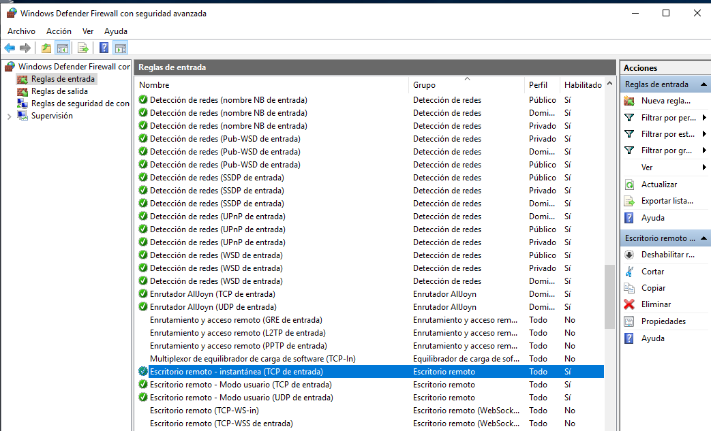</img>
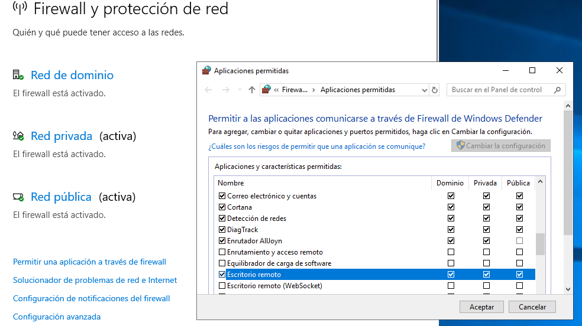</img>


