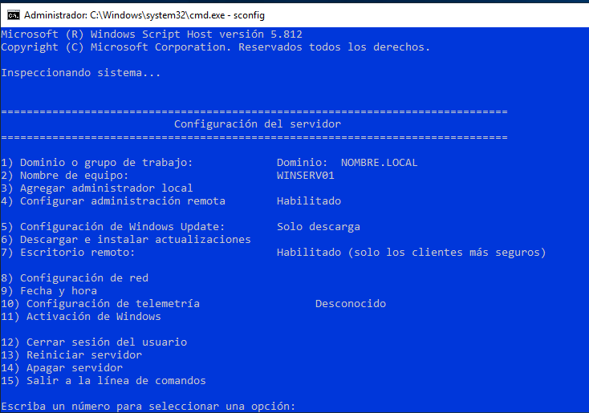
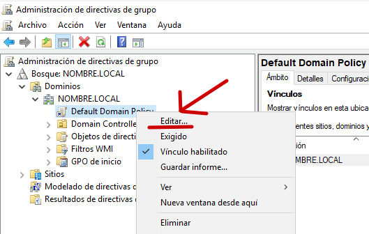

# ACCÉS REMOT

Des d'un client ( Windows 10 Pro ) creem una Connexió Remota amb el Servidor. Necessitareu:
* Que el servidor tinga habilitat l'accés remot.
* Que l'usuari en concret estiga habilitat per usar-lo.
* Que el Firewall no tinga cap regla impedint-ho.

</img>

Podem comprovar-ho també excutant des del cmd el **sconfig**

</img>

## Modificació de la GPO Default Domain Policy

Obrim la consola d'Administració de Directives de Grup.
Des de l'Administrador de Servidor o excutant **gpmc.msc**

</img>

Editem la Directiva del Domini per Defecte (Default Domain Police).

</img>

Es tracta donar a l'usuari el dret de inciar sessió de forma remota.

</img>

Devem observar el valor per defecte en la pestanya "Explicación". En este cas només podien iniciar sessió d'escriptori remot en el servidor els Administradors de domini.

</img>

</img>

>**Note**
>Recordeu executar el **gpupdate /force**
>En cas contrari no ens permetrà l'autenticació


Note
Recordeu executar el gpupdate /force En cas contrari no ens permetrà l'autenticació

gpupdate /force

Accès des del client

Firewall

Revisem les restriccions possibles del FireWall.

    Regles entrants.
    Aplicacions permeses.

```
gpupdate /force
```


## Accès des del client

</img>

</img>
</img>

## Firewall
Revisem les restriccions possibles del FireWall. 
*  Regles entrants.
*  Aplicacions permeses.

</img>
</img>


