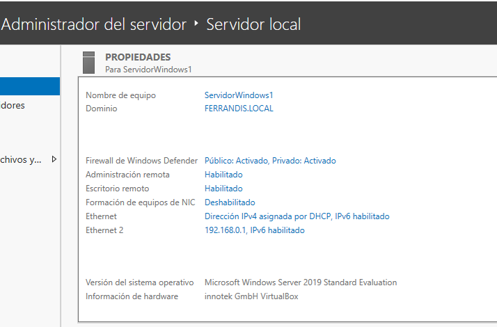

# ACCÉS REMOT

Des d'un client ( Windows 10 Pro ) creem una Connexió Remota amb el Servidor. Necessitareu:
* Que el servidor tinga habilitat l'accés remot.
* Que l'usuari en concret estiga habilitat per usar-lo.
* Que el Firewall no tinga cap regla impedint-ho.

>Inicieu una sessió remota des del client i entreu a l'explorador del Servidor

</img>

</img>

## Modificació de la GPO Default Domain Policy

Si volem iniciar sessió remota al servidor amb un usuari que no és Administrador, ho haurem de configurar, evidentment, per defecte ve inhabilitat.

</img>

</img>

</img>
</img>
