# PRÀCTICA FINAL AMB WINDOWS SERVER 2019
## DESCRIPCIÓ
L'activitat consisteix en la configuració parcial d'una LAN model Client/Servidor per a una empresa dedicada al desenvolupament d'aplicacions multiplataforma. Usarem un servidor Windows Server 2019 i dos clients Windows Professional 2010 en VirtualBox.

Organitzarem els usuaris i els ordinadors clients atenent a la seua funció en Grups. Els Grups, al mateix temps, s'agruparan en Unitats Organitzatives segons el projecte a desenvolupar. 

### 1.  L'organització final dels objectes quedarà amb l'estructura de **Unitats Organitzatives**  i **Grups** següent:

| GRUP|USUARI|
|--|--|
|grDisseny_01|tomas, ariadna, PC01|
|grProgramacio_01|aitana, rosa, PC01|
|grDepuracio_01|isabel|

*( els grups també contenen algun PC client )*

|UO|entitats|
|--|--|
|uoProjectesERP|grDisseny_01, grProgramacio_01, grDepuracio_01|
|uoProjectesFARMACIA|||

### 2.  Tots els usuaris tindran **PERFILS MÒBILS**
Assegurarem que tots els analiste i programadors diposen de perfils mòbils.

*(En les còpies de seguretat s'inclouran els perfils dels usuaris)*

### 3.  Hi haurà 3 **CARPETES COMPARTIDES** amb la següent configuració de permisos ( **NTFS** ) tal que:

 |Carpeta|grDisseny|grProgramacio|grDepuracio|Administradors|
 |--|--|--|---|--|
 |ANALISI|Modificar, Escriure, Llegir, Executar, Llistar |Llegir, Executar, Llistar| Llegir, Executar, Llistar|Control Total|
|CODIFICACIO|Llegir, Executar, Llistar|Modificar, Escriure, Llegir, LListar i Executar | Modificar, Escriure, Llegir, LListar i Executar. NO *Crear arxius / Carpetes Ni Escriure Dades/ annexar*|Control Total|
 |DEPURACIO|Llegir, Executar, Llistar| Llegir, Executar, Llistar| Modificar,Escriure, Llegir, LListar i Executar|Control Total|

### 4.  La contrassenyes dels usuaris hauran de complir les restriccions següents:
*   Ser complexes
*   Longitud mínima de 8 caràcters.
*   Durada màxima de 45 dies.

### 5. Usuari no administrador però amb privilegis.

Per tal de poder fer tasques senzilles d'aministració com reiniciar les contrassenyes d'un usuari, bloquejar o limitar-li el termini d'inici de sessió, sense necessitar la intervenció de l'administrador
de la xarxa, s'habilitarà un usuari per cada UO.

* Haurà de tindre la delegació de control en la UO.
* Poder accedir de forma remota al servidor

# GUIA PER RESOLDRE L'ACTIVITAT

>Heu de fer una captura de les comprovacions demanades en text ombrejat.
## PRIMERA PART:    Instal·lacions i Domini.

### Instal·lació 

Instal·lació de les màquines virtuals.
*  Windows 10 Pro.
*  Windows Server 2019.

Asssegurar que hi puga haver connectivitat:
1.  Configurar les MV com a Xarxa Interna
2.  IPs privades en la mateixa xarxa. Per exemple: 
    IP Windows 10 Pro: 192.168.0.2 /24
    IP Windows Server; 192.168.0.1 /24
    Windows+R: Configuración, Red e internet, Centro de Recursos Compartidos, Ethernet
3.  Llevar les restriccions del FireWire de Windows en totes les màquines.
4.  Tant en el servidor com en els clients Windows 1x: Windows+R: Configuración, Red e internet, Centro de Recursos Compartidos, Cambiar configuración del  Uso compartido avanzado:
    * Activar la detección de redes
    * Activar el uso compartido de carpetas e impresoras.

>Comprovar que tenim connectivitat fent **ping** i **ipconfig**.

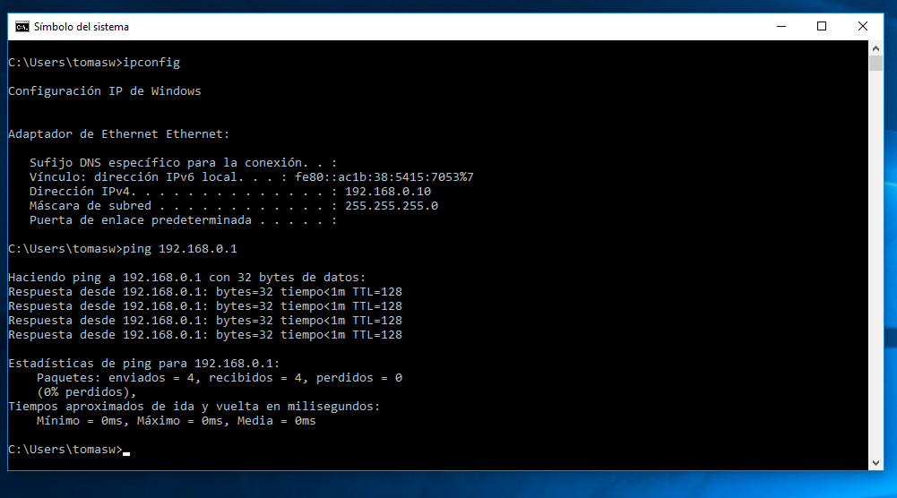

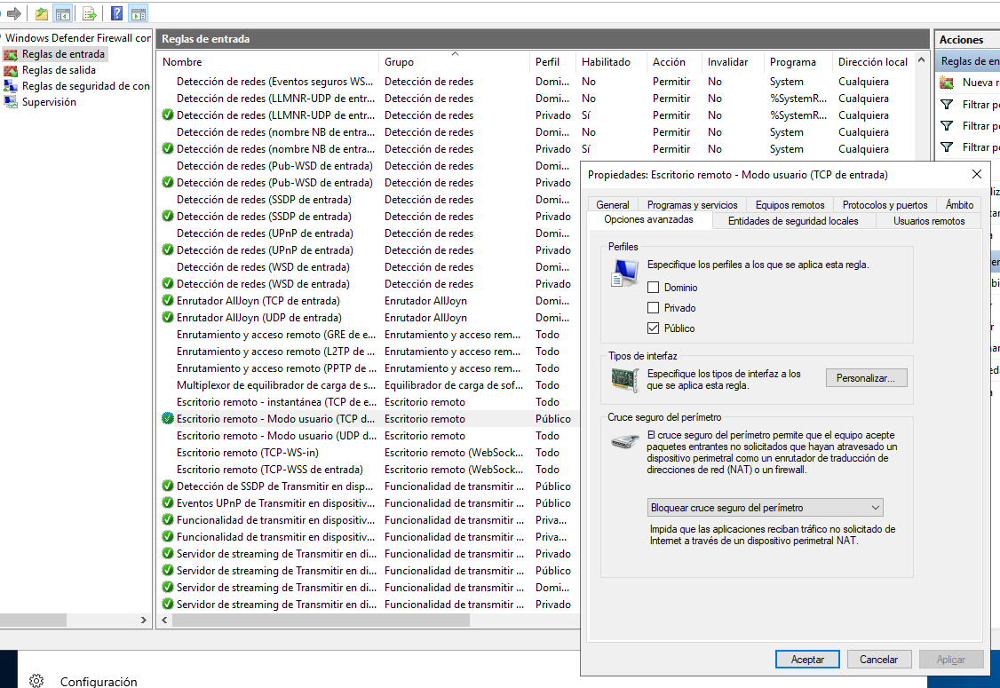</img>

### Crear el Domini.
De moment el que tenim és una LAN del tipus Work Group ( grup de treball ). Usuaris locals de cada màquina i cap administració centralitzada. Per passar de WORKGROUP -> DOMAIN cal que:

1.  Instal·leu el Active Directory ( AD-DS )
2.  Promocioneu el servidor.

Per al nom de domini podeu usar el vostre cognom afegint el ".LOCAL": COGNOM.LOCAL 

> Visualitzeu i comproveu el Domini en **Usuaris i Equip d'Active Directoy**, podeu entrar executant **dsa.msc**

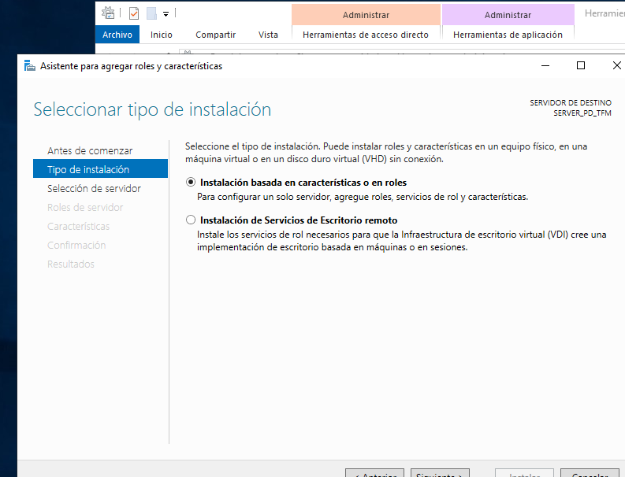</img>

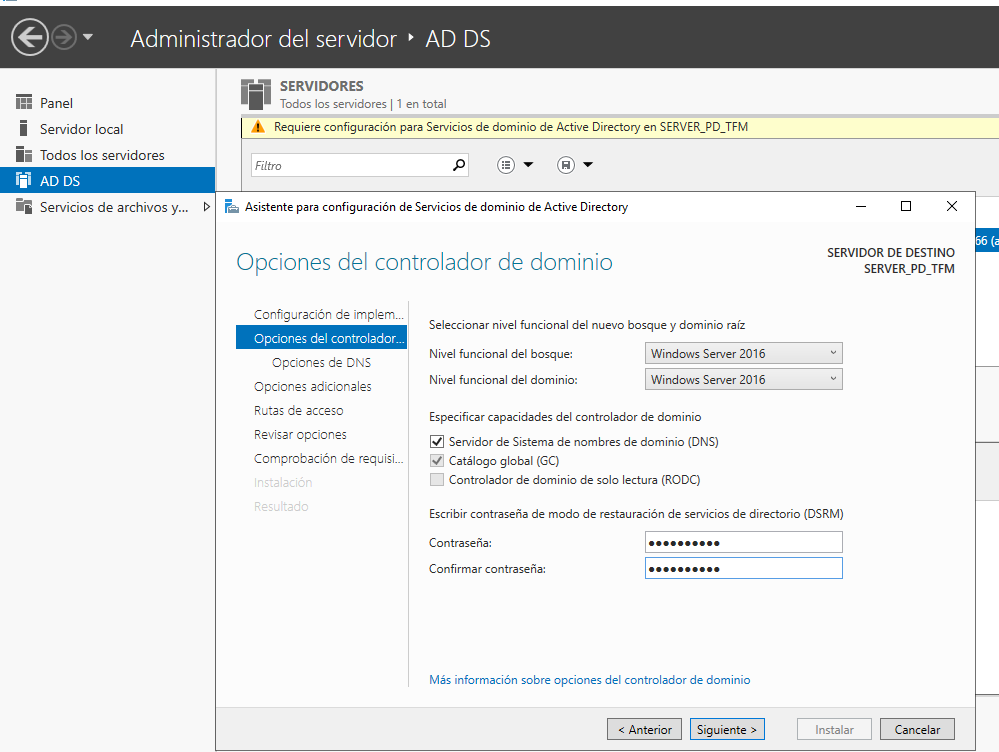</img>

## SEGONA PART: L'Active Directory.

### Afegir el PC client al Domini.

Canvieu el nom del PC Client i el Domini al qual pertany.
Panel de Control, Sistema, Cambiar configuración
o
Este Equipo, Propiedades...

Vos demanarà un **compte amb drets d'Administrador en el Domini**.

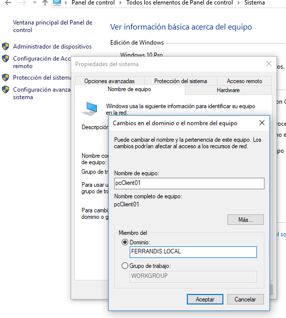</img>

> Comproveu que en l'Active Directory apareixen els PCs clients com entitats del domini.

Podeu entrar executant el **dsa.msc**

</img>

## Crear les entitat que falten al domini.

Useu este ordre: 

1.  Usuaris del domini.
2.  Crear les UO
3.  Crear els grups dins de les UO
4.  Incloure els usuaris i PC en els grups corresponents.

## TERCERA PART. Permisos i compartició de carpetes.

### Crear, compartir carpetes i assignar de permisos a les carpetes.

Useu la consola **fsmgmt.msc** de CARPETES COMPARTIDES per crear, compartir i assignar permisos NTFS.

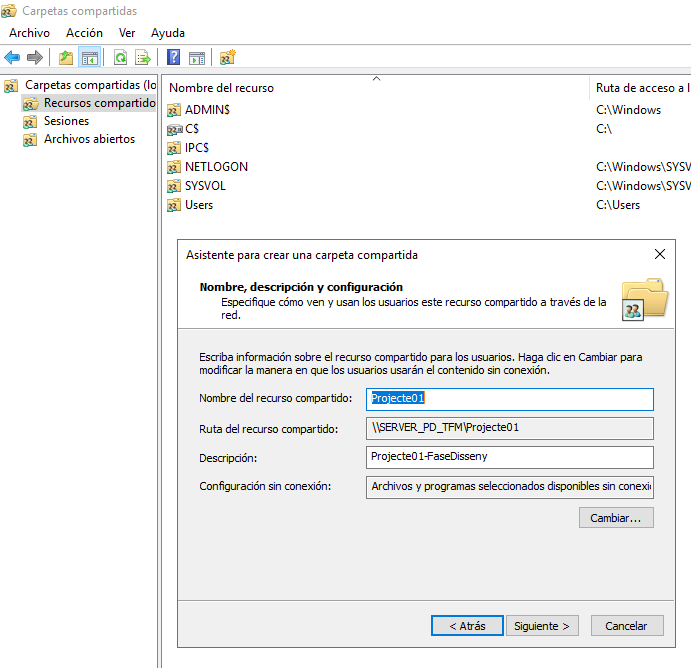</img>

Configureu els permisos NTFS especials inclosos. 
Assignem permisos **NTFS** per a cada grup seguint les especificacions.

>Comproveu canviant de sessió des d'un PC client

Des d'esta consola podem gestionar molt millor els recursos compartits ( vore els ocults, eliminar algun que ha desaparegut o canviat, tancar algun fitxer o sessió que haja quedat oberta... ).

## QUARTA PART: Directives de Windows.

### GPO per a les contrassenyes dels usuaris.

Caldrà crear una nova Directiva de Grup. Podem entrar executant **gpmc.msc**
Creem una directiva de grup que vincularem a la UO que ens interesse o al Domini.

</img>

Recordem que hem d'executar **gpupdate /force** per a que els canvis tinguen efecte.
> Des d'*Usuaris i equips de l'AD* , executeu *Restablir Contrassenya* d'algun usuari i proveu la nova directiva.

### GPO per a capturar unitats de xarxa.
Alternativament als scripts.

Creem una Directiva de Grup que per a que tots els usuaris d'un projecte, en iniciar sessió tinguen una capturada una unitat de xarxa.
</img>

### CINQUENA PART. Accés remot

Des d'un client ( Windows 10 Pro ) creem una Connexió Remota amb el Servidor. Necessitareu:
* Que el servidor tinga habilitat l'accés remot.
* Que l'usuari en concret estiga habilitat per usar-lo.
* Que el Firewall no tinga cap regla impedint-ho.

>Inicieu una sessió remota des del client i entreu a l'explorador del Servidor.

</img>

</img>

### Modificació de la GPO Default Domain Policy

Si volem iniciar sessió remota al servidor amb un usuari que no és Administrador, ho haurem de configurar, evidentment, per defecte ve inhabilitat.

</img>

</img>

</img>

</img>

## CINQUENA PART: Perfils mòbils.

Si només tenim un PC Client. Haurem d'iinstal·lar un segon per poder fer les proves de perfils mòbils.
Recordeu, importeu o cloneu:

*   IP pcClient02 192.168.0.3 /24
*   DNS: 192.168.0.1/24
*   Reviseu el FireWall.

1.  Crear un carpeta Perfils.
2.  Compartir-la i donar permisos d'escriptura als usuaris del domini que vullguem.

> Comprova usant els dos client amb un usuari.

</img>

Assigna l'adreça en les PROPIETATS de cada usuari.
Podeu entrar executant el **dsa.msc**

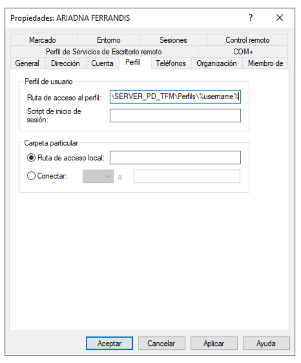</img>
</img>

## Delegació de control sobre la UO

L'usuari especial que volem que tinga determinats drets haurà de tindre el control sobre la UO.

### SETENA  PART. RAID 1.
1. Afig dos discos durs d'igual tamany i munta un RAID1

</img>
</img>
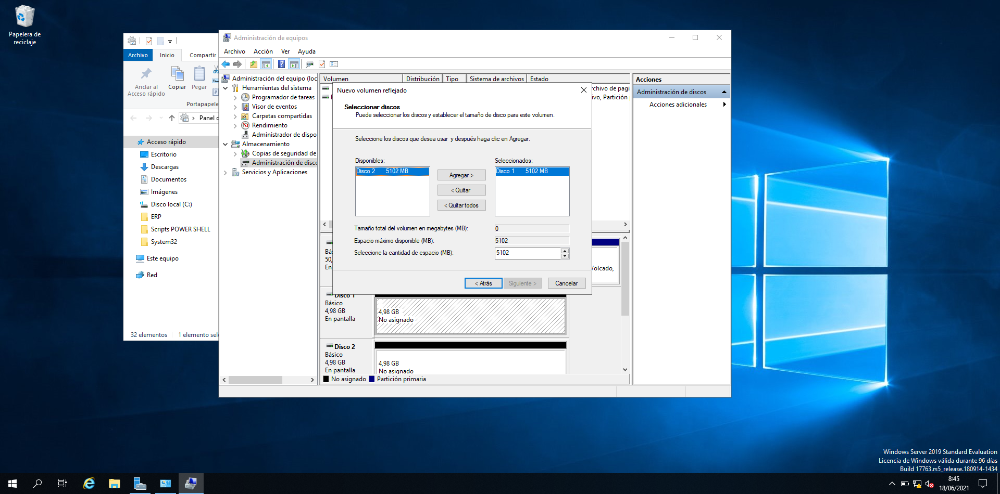</img>

### HUITENA PART. BACKUP 

#### Instal·lar ROL de Backup

Per poder usar la utilitat de Backup de Windows Server cal tenir-la instal·lada. 
En este cas no la tenim instal·lada com podem observar:

</img>

Instal·lem la funció des de l'administrador del servidor:

</img>
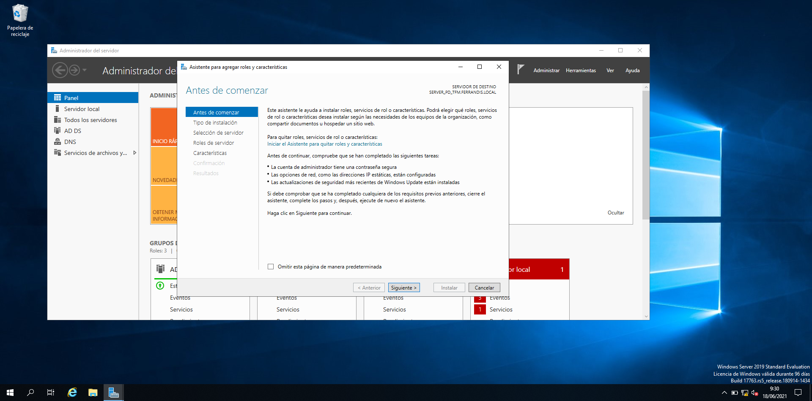</img>
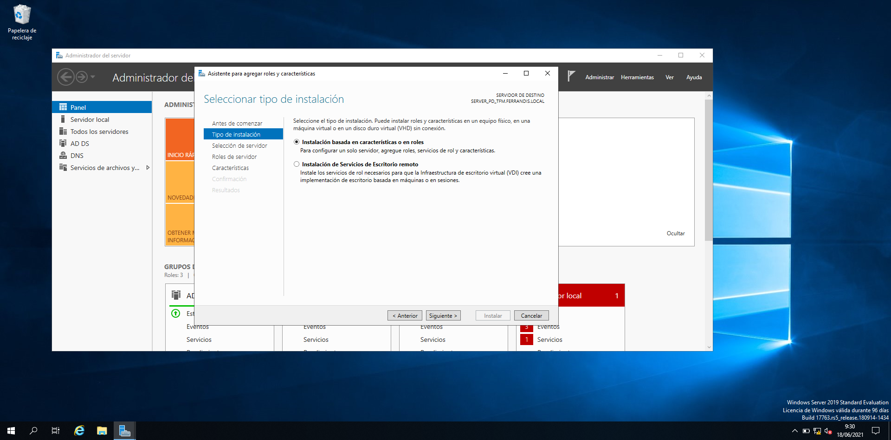</img>
</img>
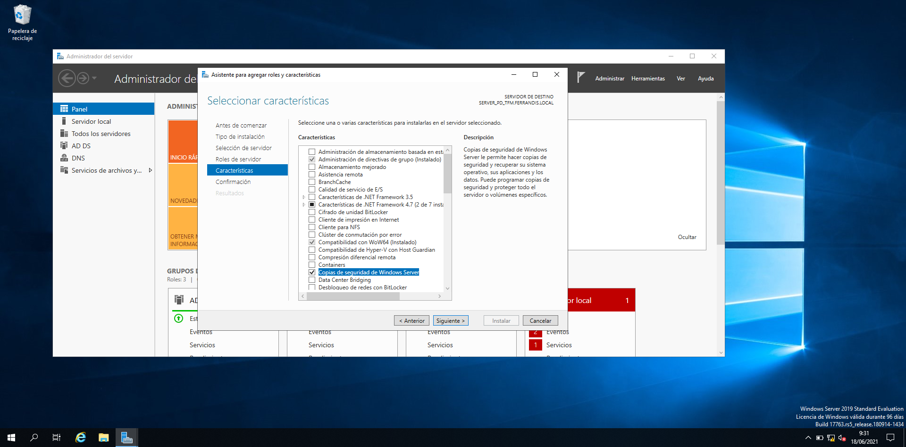</img>

#### Executem el servei Backup.

Podem optar per còpia completa o incremental. És convenient fer-les a un disc diferent. Hem muntat un nou disc.

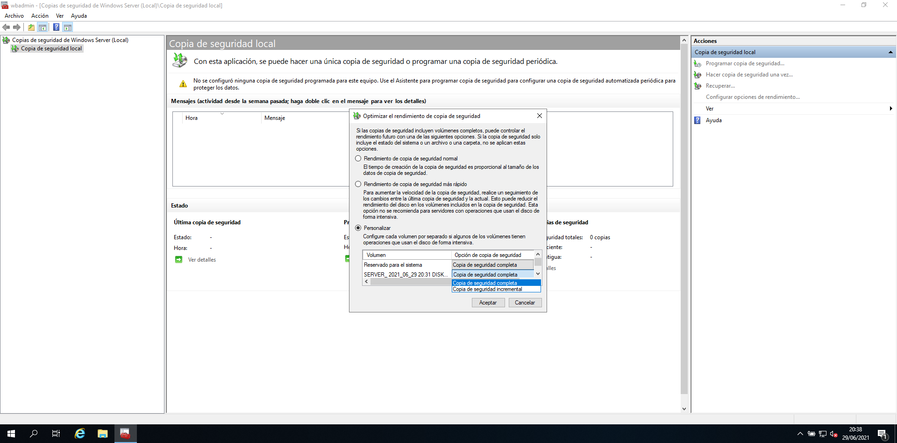</img>
</img>
</img>
</img>

