# RAID 1.
1. Afig dos discos durs d'igual tamany i munta un RAID1

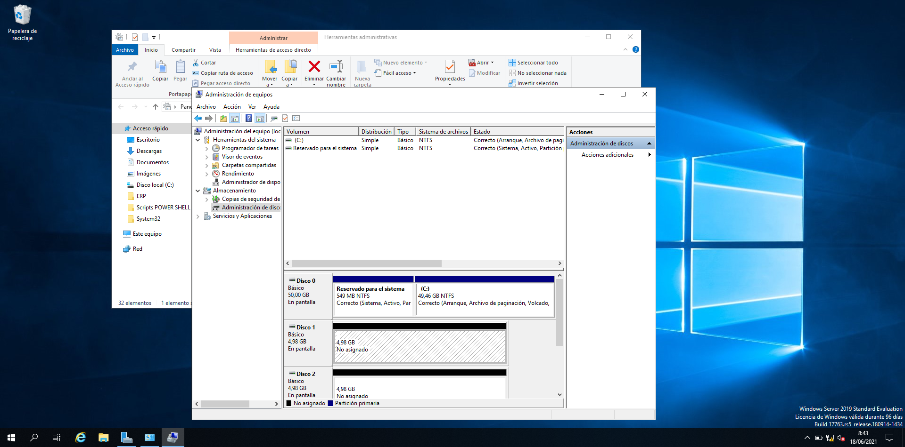</img>
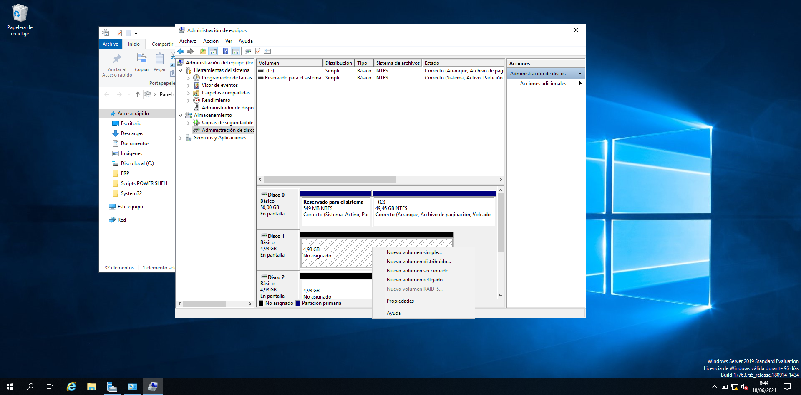</img>
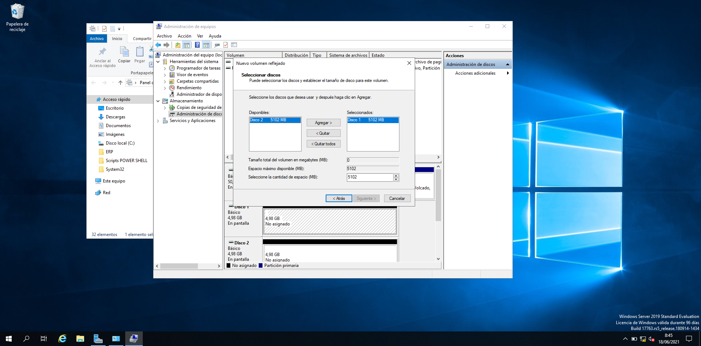</img>

# BACKUP 

## Instal·lar ROL de Backup

Per poder usar la utilitat de Backup de Windows Server cal tenir-la instal·lada. 
En este cas no la tenim instal·lada com podem observar:

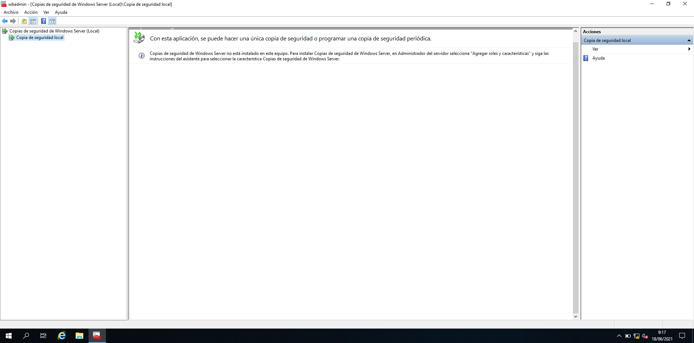</img>

Instal·lem la funció des de l'administrador del servidor:

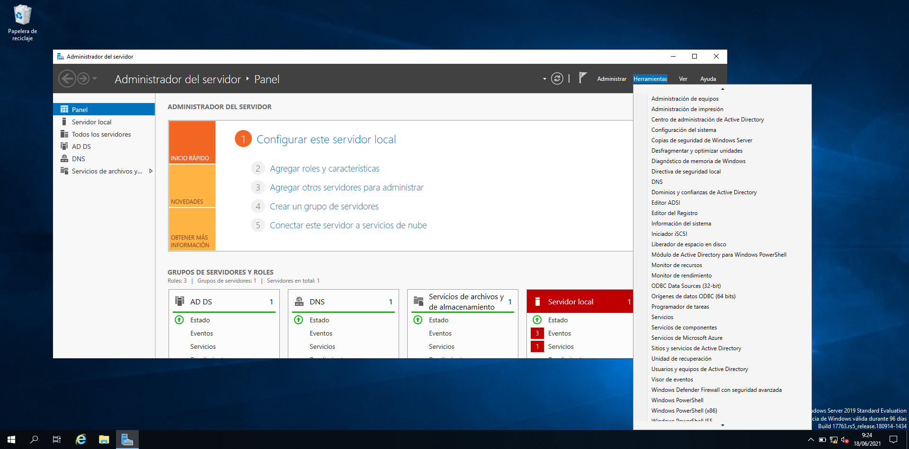</img>
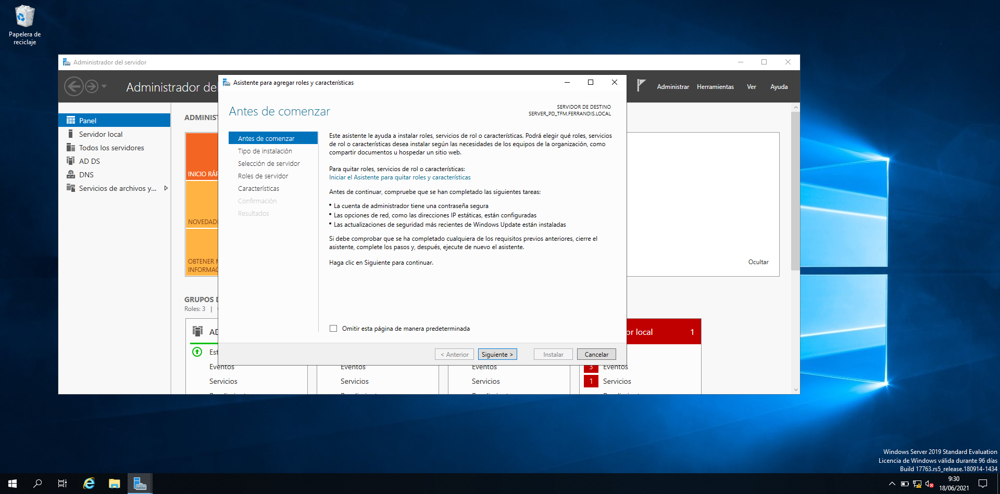</img>
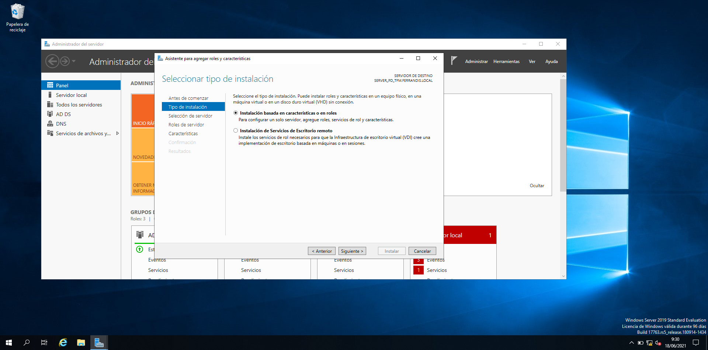</img>
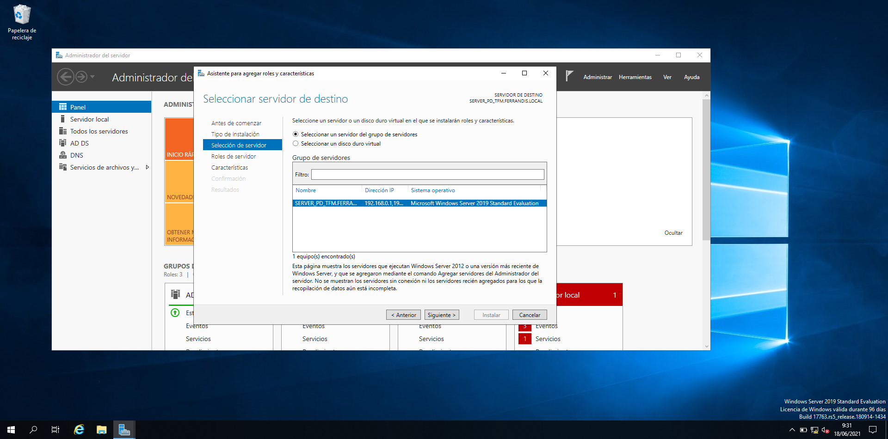</img>
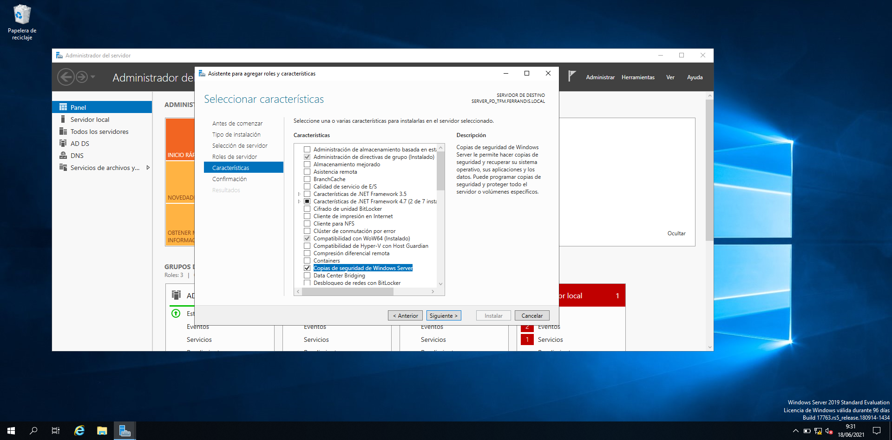</img>

## Executem el servei Backup.

Podem optar per còpia completa o incremental. És convenient fer-les a un disc diferent. Hem muntat un nou disc.

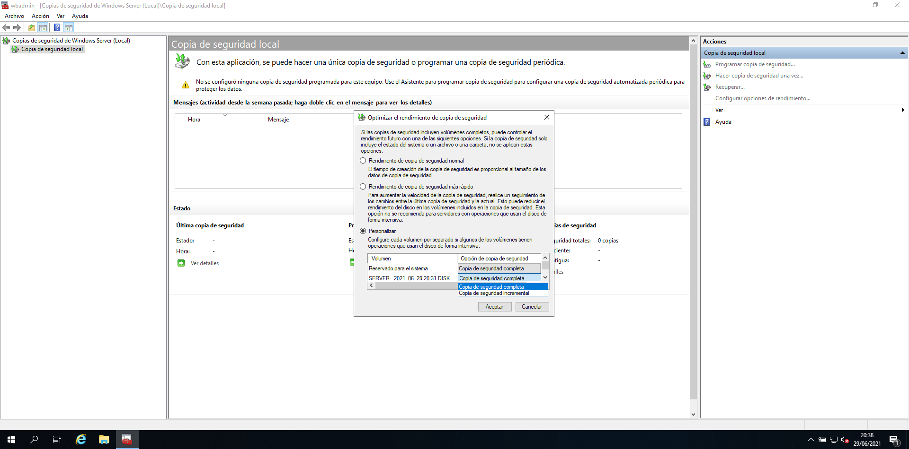</img>
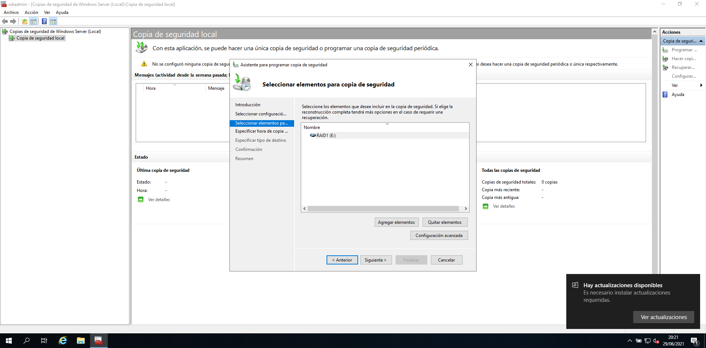</img>
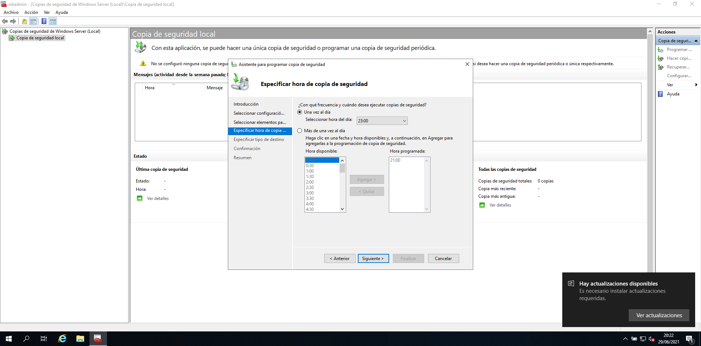</img>
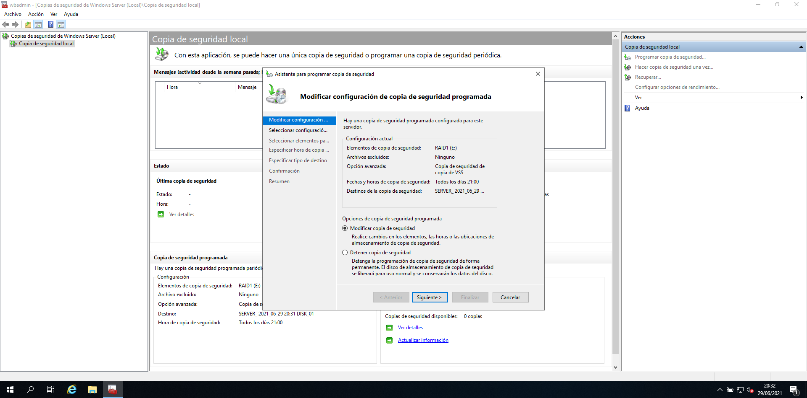</img>
