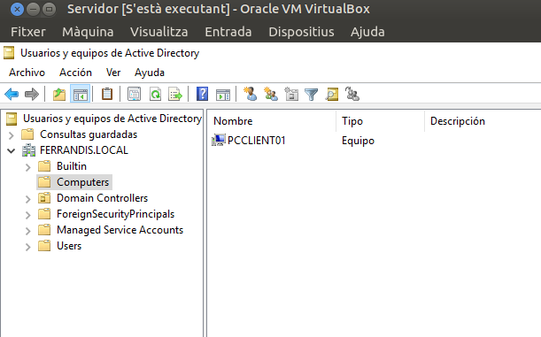
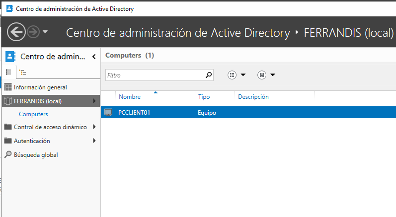
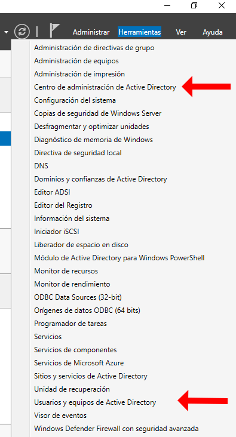
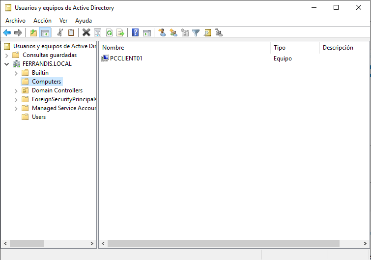
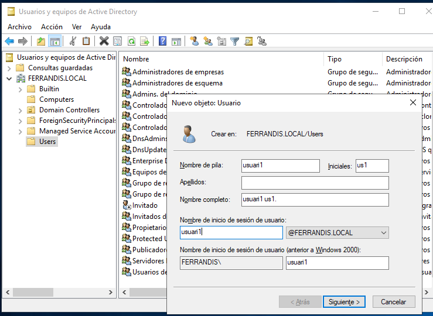
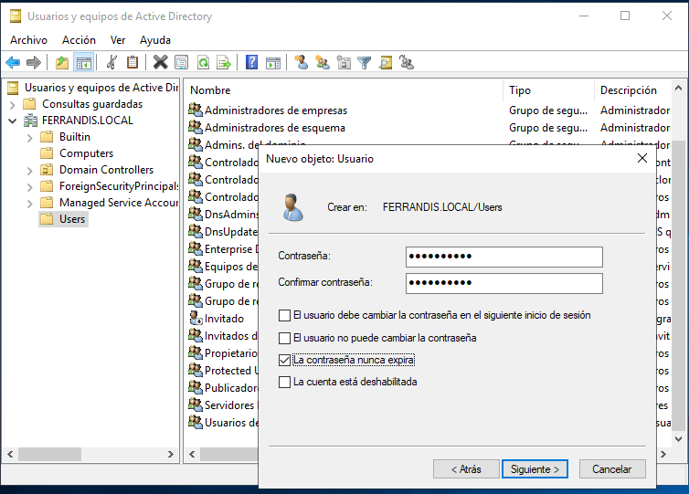
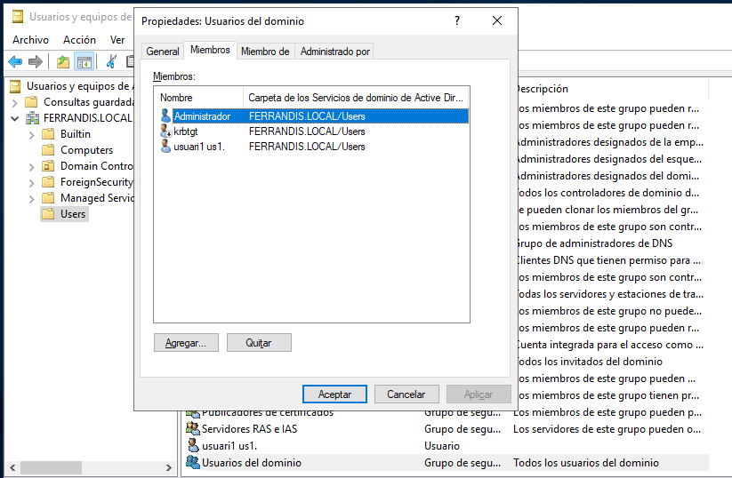

# AFEGIR UN CLIENT AL DOMINI

## 1- Revisem connexió del client

>**note**
>Assegurem que tenim el client configurat com cal (Mirar Instal·lació i configuració del Windows Server). Ho recordem:
>
>      *  IP del mateix rang que la del servirdor
>      *  La IP del DNS, la del servidor DNS
>      *  Firewall permetent la compartició de fitxer en ICMP
>       * Compartir i detectar xarxes activat
>

## 2- Afegim el client al Domini
*Panel de Control, Sistema, Cambiar configuración*
o
*Este Equipo, Propiedades...*

</img>

Vos demanarà un **compte amb drets d'Administrador en el Domini**.
Podem usar el que hem creat en la instal·lació del Server.

</img>

:computer: En el SERVIDOR, podeu visulitzar el PC afegit al Domini en **Usuaris i Equips d'Active Directoy**

Podeu entrar executant el **dsa.msc** ( Winn + R ...)

</img>

## 3.  Iniciem sessió al Domini des del Client

Per iniciar sessión en el domini des del Windows 1X, encara que podríem usar algun usuari de domini predefinit com el mateix compte d'Administrador, el que farem prèviament és crear un usuari nou. De fet el normal és disposar de comptes per als usuaris reals de l'organizació.

**3.1 Creem l'usuari**
Des de l'Administrador del Servidor veiem les dos funcionalitats des d'on podem accedir a la gestió de comptes.

</img>

Centro de Administración del Active Directory

</img>

Usuarios y equipos del AD

</img>

**Contrasenya amb requisits de complexitat**

Si intentem indicar una contrasenay senzill, curta, fàcil... vorem que no ens ho permet el SO. Més avant tractarem estos requisits i altres característiques de la contrassenya i dels comptes. 

</img>

</img>

**El grup "Usuarios del dominio"**

Observem que tots els usuaris del domini perntanyen a un grup preexitent "Usuarios del Dominio".

</img>

**Iniciem sessió**

Com la màquina client ja pertany al domini, en iniciar sessió del Windows 1x només cal selecionar un usuari del domini nou usuari.

>**Nota**
>Més avant vorem amb un poc més de detall la configuració de les entitats del AD i les seues relacions. També tenim documentació per a la seua gestió mitjançant cmdLets i scripts fets amb Powershell
>

**Característiques dels usuaris de domini al client**

* El nou usuari (usuari1) tindrà un perfil al PC Client però
* NO és Administrador del PC Client. Qualsevol canvi de configuració que intente fer, el Windows 1x li demanarà les credencials d'Administrador local ("tomas", a l'exemple)
* Quan vullguen inicar sessió amb l'Administrador del Windows 1x, devem canviar de "domini", això ho farem avantposant al "login" el **nom de la màquina local** (a l'exemple: "PCCLient\tomas" )
* Amb este usuari, si es podria fer Administrador Local ( del Windows 1x ) a l'usuari del domini ( "usuari1")
* Quan iniciem sessió en el domini, caldrà fixar-se i, si cal, avantposar també el **nom netbios del domini** ("FERRANDIS\usuari1")

  Fi.
  

* ANTERIOR UNITAT: INSTAL·LACIÓ I CONFIGURACIÓ D'UN AD-DS
*  SEGÜENT UNITAT: CARPETES COMPARTIDES SHARE
