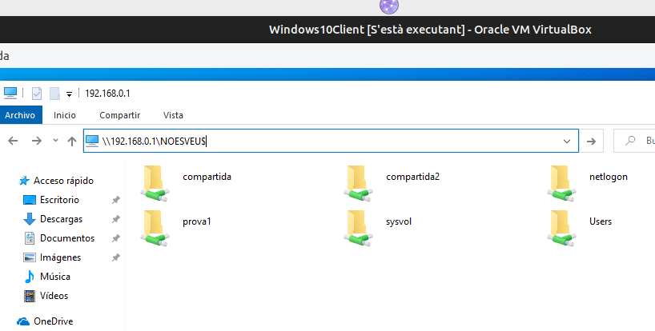

# COMPARTIR CARPETA. PERMISOS SHARING

En Windows tenim dos sistems de compartició per a carpetes i fitxers. 
* Sharing o compartició de carpetes. Admet només permisos de Lectura, Escriptura i Control Total. Poden aplicarse sobre particions NTFS o FAT32.
* NTFS, permet detallar més les accions a poder fer en el sistema de fitxers. En xarxa s'aplicará després de l'anterior per concretar més el permisos. Només s'apliquen sobre particions NTFS.

## 4.1 COMPARTICIÓ SENZILLA. LLEGIR O ESCRIURE

Des del Servidor compartim unes carpetes.

</img>

</img>

## 4.2 COMPARTICIÓ AVANÇADA.

**CONTROL TOTAL** Permís per a canviar el permisos i propietari.
**NOMBRE D'ACCESOS PERMESOS** Podemo limitar la quantitat d'usuaris de la xarxa que poden accedir al mateix temps.
**NOM DEL RECURS COMPARTIT** Si volem que la carpeta es veja a la xarxa amb un altre nom

</img>
</img>
</img>

## 4.3 ACCÉS PER LA XARXA A LES CARPETES COMPARTIDES
Des del client podem ja accedir als primers recursos compartits.

**4 formes d'accedir**
Si observem, podem vore les carpetes des de Red del client ( Windows 1x ) de 4 formes.

* Gràficament des de l'explorador buscant el servidor
* Gràficament des de l'explorador amb la IP del servidor. Útil per a:
    * Descatar si falla la resolució de noms per provar però no la connexió a nivell de xarxa.
    * Visulitzar els directoris ocults escrivint el nom de recurs compartit amb el $
* Des de l'interface d'ordres amb NET SHARE. Només per visualitzar.
* Des de Powershell ( Ho estudiarem més avant )

  </img>

  </img>

  </img>
  
