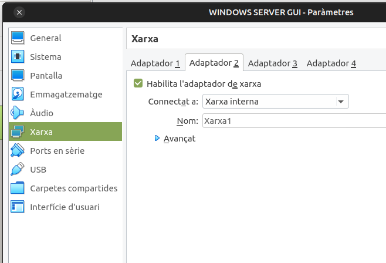

# IMPLANTACIÓ DE L'ACTIVE DIRECTORY EN WINDOWS SERVER 2019 AMB ENTORN GRÀFIC
## Resum

Amb una màquina virtual Windows Server i dos màquines de Windows 1X en VirtualBox emularem una xarxa Client/Servidor instal·lant el Servei de Directori: **Active Directory**

1.  Configurarem les MV com a Xarxa Interna. Emulem una xarxa local de computadores connectades a un switch.
2.  Configuració mitjançant IP fixes. IPs privades en la mateixa xarxa. 
3.  Assegurarem la connectivitat entre màquines. ( Detecció de xarxes i compartició en Windows, Firewall...)
4.  Creem el domini i fem el servidor Windows Server com a Controlador del domini.
5.  Afegim un client Windows 1x.
6.  Crearem un usuari del domini i inciarem sessió al domini des del client.

Comprovar que tenim connectivitat fent **ping** i **ipconfig**.

## 1 CONFIGURAR EL SERVIDOR

### 1.1 "Xarxa Interna" en VirtualBox.

Afegirem 2 targes, una per a emular la xarxa local ( Xarxa interna ) i l'altra per disposar de la connexió d'Internet de l'amfitrió.

</img>
</img>

En el WINDOWS 1x hem de tindre NOMÉS la tarja interna.

### 1.2 Configuració de la xarxa local en Windows

*Windows+R: Configuración, Red e internet, Centro de Redes y Recursos Compartidos*

</img>

Ho hem de revisar en **LES DOS MÀQUINES**

**Detecció de xarxa i ús compartit**

*Win+R: Configuración, Red e internet, Centro de Redes y Recursos Compartidos, Cambiar configuración del  Uso compartido avanzado:*
    
    * Activar la detección de redes
    * Activar el uso compartido de carpetas e impresoras.
    
</img>

Ho hem de revisar en **LES DOS MÀQUINES**

**IPs privades en la mateixa xarxa.**

    IP Windows 1X: 192.168.0.2/24    
    IP Windows Server: 192.168.0.1/24
    
*Windows+R: Configuración, Red e internet, Centro de Redes y Recursos Compartidos, Ethernet*

</img>

### 1.3 Provar la connectivitat amb el protocol ICMP (ping)

**Revisar les les restriccions del FireWall de Windows**

</img>

Ho hem de revisar en **LES DOS MÀQUINES**

**Provar el ICMP**

</img>

### 1.3 Canviar el nom del servidor

</img>

### 1.4 Revisar aspectes bàsics de la configuració
Un exemple podria ser desactivar/activar el Servei d'actualitzacions.

</img>

Altre exemple podria ser assegurar la Zona horària.

</img>

## 2 CREAR EL DOMINI
De moment el que tenim és una LAN del tipus WorkGroup (grup de treball). Usuaris locals de cada màquina i cap administració centralitzada. 
Per passar de WORKGROUP -> DOMAIN caldrà que:

1.  Instal·leu el Active Directory ( AD-DS )
2.  Promocioneu el servidor a Controlador del Domini (DC)

### 2.1 Instal·lació de l'Active Directory

</img>

</img>

</img>

</img>

</img>

### 2.2 La Promoció de Windows Server a Domain Controller (DC)

</img>
### 2.3 Crear un nou bosc

</img>

</img>

La ressolució de noms, de moment, no la configurem.

</img>

**Nom NetBios del Domini**

</img>

**Carpetes importants**

</img>

**Resum de les accions fetes i Script**

</img>

>**NOTA**
>L'script que podem descarregar-nos ens serà útil en la implementació del AD-DS en un Windows Server Core. Per executar-lo cmdLet a cmdLet o com a script >desant-lo amb l'extensión *.ps1

SEGÜENT UNITAT: CARPETES COMPARTIDES SHARE
