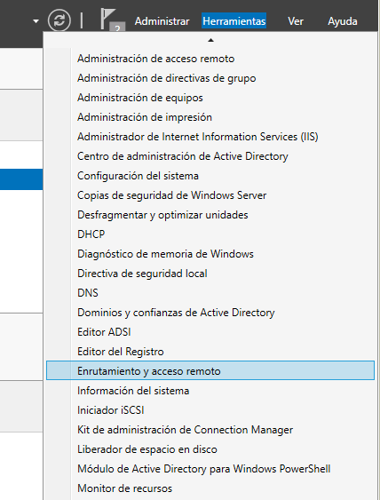
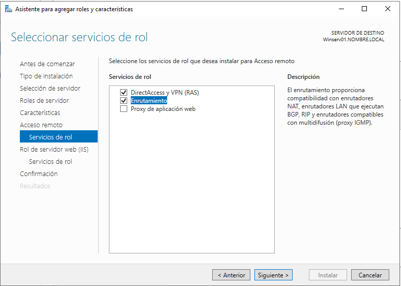
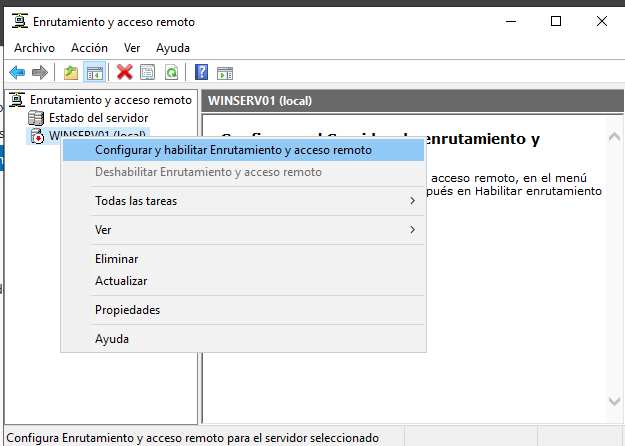
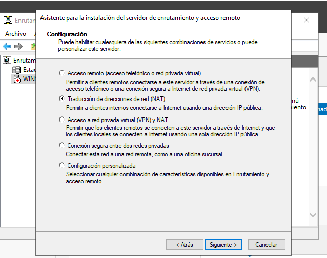
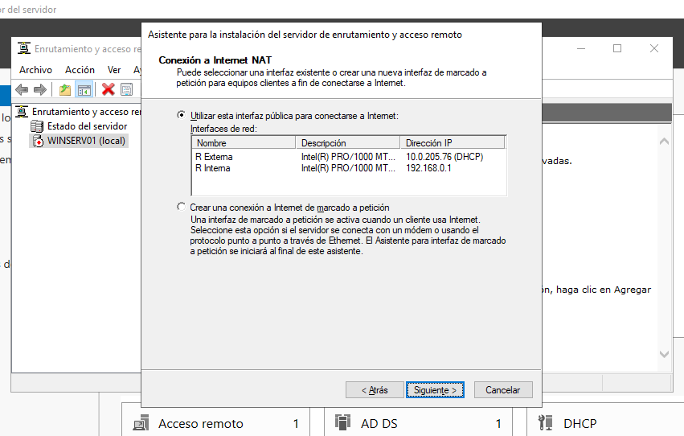
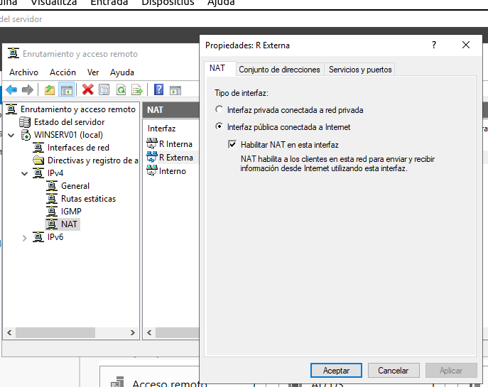

# ENRUTAMENT EN XARXA WINDOWS.

## Esquema de la instal·lació.

</img>

# Esbrinar la IP del Router
</img>

# Configuració de les targes en Servidor

</img>

Ens dona un avís de possible error...

</img>

Es normal donat que la IP del GateWay no és del rang de la IP estàtica (no pot comunicar-se )...
Confirmem ("Si") que volem esta configuració. El problema se solventarà precisament en acabar de configurar l'enrutament.

# Instal·lació del ROL "Acceso remoto"

</img>
</img>
</img>

## Configuració

</img>

</img>
</img>

</img>
</img>

# Configuració de la tarja del client IP Estàtica

</img>

# DHCP

## GateWay en el Servicio DHCP del Servidor

</img>

</img>

## Prova

</img>

