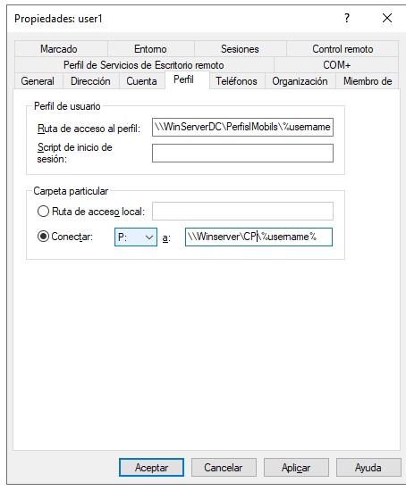

# Perfils mòbils.

>🔎: Recordeu si feu importació de màquines virtuals o restaureu imatges, revisar les IP i MAC

Primer crearem una carpeta per a que tots el usuaris del domini guarden el seu perfil. Això, a més, facilitarà el Backup si se'ns demana.

1.  Crear un carpeta Perfils.
2.  La compartim (Permisos SHARE) amb permisos d'escriptura als usuaris del domini que vullguem.

> Comprovarem inciciant la sessió en dos PC clients amb el mateix usuari.

</img>

Assigna l'adreça en les PROPIETATS de cada usuari.

Podeu entrar executant el **dsa.msc**

</img>
</img>

Una vegada es crea una carpeta per cada usuari al servidor podem redirecciona Mis Documentos, Descargas...

Avantatges:
* Possibilitat d'iniciar la sessió en qualsevol PC client i disposar del teu perfil ( Escriptori, Documents, Baixades...)
* Possibilitat de que l'Operador de còpies de seguretat programe un backup del nostre perfil.
  
Desavantages:

* La càrrega del perfil des del servidor fins el PC client genera un tràfic a la xarxa local que pot notar-se en iniciar tots el usuaris al mateix temps.
* Els usuaris poden desprocupar-se del tamany de les seues dades i acabar, entre tots, ocupant massa espai de disc dur al servidor.

# Carpetes particulars

Son unes carpetes que poden ser emprades per desar els treballs de cada usuari a efecte de centralitzar els backups. Mentre el perfil mòbil quedaria per a dades menys permaments o particulars. 

L'exemple següent veiem com assignem una unitat a una carpeta compartida al servidor ( des del matei servidor!). Accedint a ella entrarem a través de la xarxa.

</img>

>:mag:
>
>Moltes d'estes funcionalitats que estem aplicant de forma individualitzada, més avant vorem que es poden (i deuen) fer de forma més automatizadad per atots els usuairs o PC de les UO o Domini.
>Ací és on entren en joc els scripts amb cmdLets de PowerShell i les Directives de grup.

