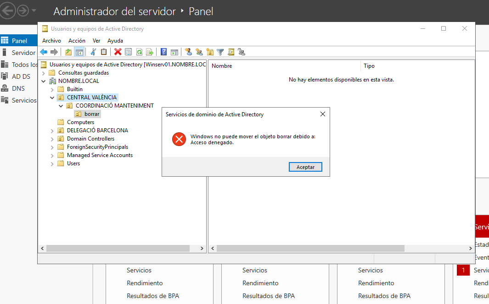

# Unitats Organitzatives en Windows Server (GUI)
Les UO son agrupacions o subdivisions del domini per tal de facilitar l'administració. Contenen recursos i objectes.
Estes subdivisions poden fer-s'hi en base a 3 criteris:

1.  Geogràfic o territorial ( Les típiques delegacions de les empreses .
2.  Organització interna ( agrupant departaments de l'empreses que poden equivaldre a grups d'usuaris...)
3.  Dinàmiques, de projectes on van incorporant-se o abandonant usuaris per exemple.

>**Note**
>Per a la gestió de UO des del PowerShell consulteu la fitxa corresponent:
>https://github.com/tofermos/PowerShell/blob/main/ADunitatsOrganitzatives.md

## Creació

</img>

Podem aniuar-les ( unes dins d'altres ) i fer que hereten les "propietats"

## Proteccio contra eliminació i canvi accidental
Quan intentem moure o eliminar una UO tenim un missatge avisant que el canvi pot fer que deixen d'alicar-se directives o afectar als usuaris que la controlen (per exemple).
</img>

Si acceptem veiem que és habitual que no ens deixe.

</img>

Per defecte es creen protegides per evitar eliminacions o canvis d'ubicació accidentals. Ho hem de desprotegir prèviament.

</img>

</img>

# Delegació 

És interessant que assignem el control dels objectes i recursos de la delegació territorial/secció de l'empresa/projecte a un usuari.

</img>

>**Note**
>El més habitual serà que l'usuari siga Administrador i puga iniciar sessió de forma remota.
>Consulteu la fitxa de Escriptori Remot

