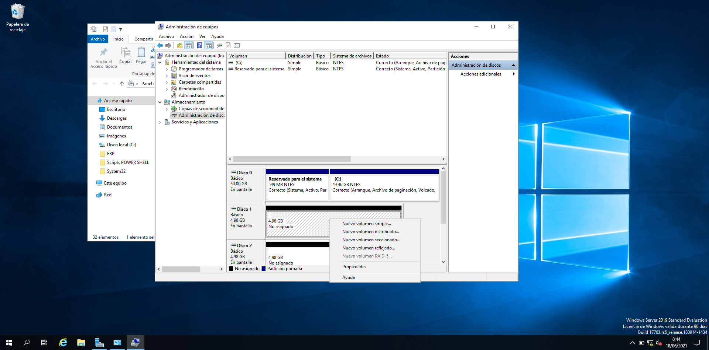
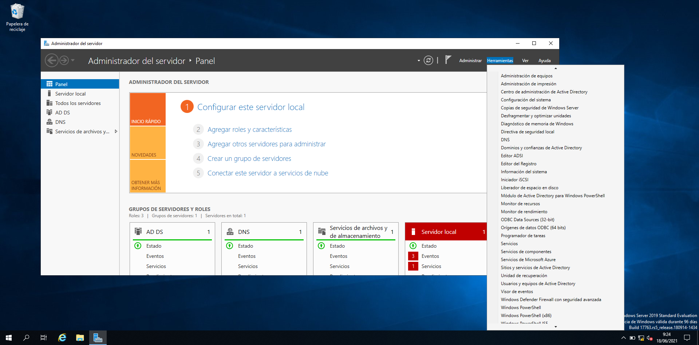
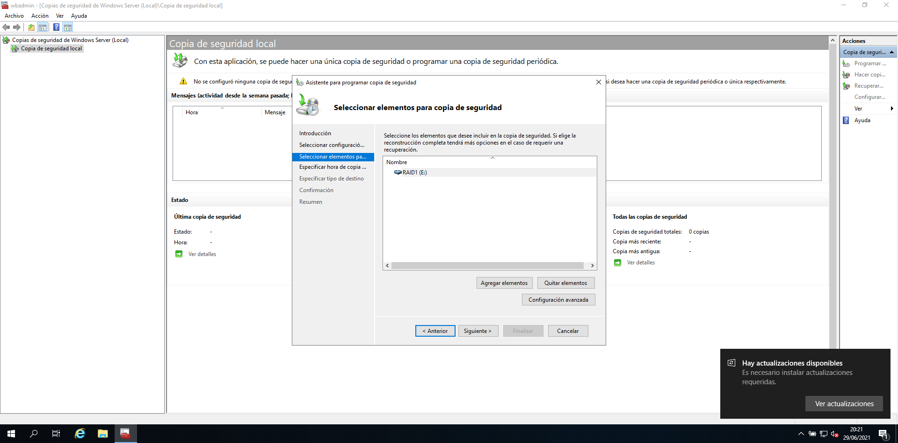
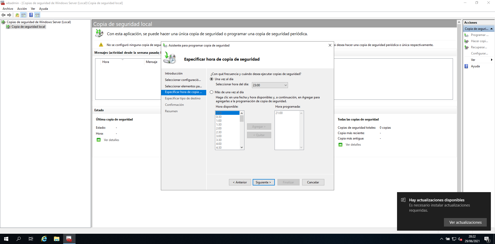
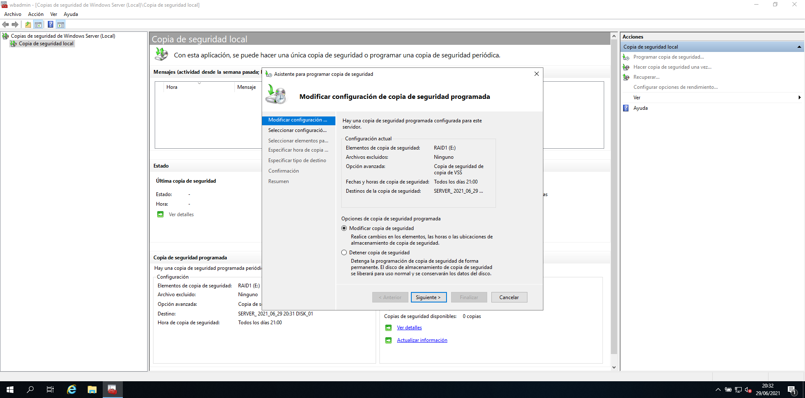

## Resum
En esta segona part vorem alguns aspectes relacionats amb la compartició de dades, la seguretat lògica i física d'estes i l'accès a les m`quines.

1.  Compartició de carpetes ( Permisos Sharing )
2.  Permisos NTFS
3.  Contrassenyes d'usuari.
4.  Drets per iniciar sessió i Accés remot.
5.  RAID
6.  Backups

## 1 CARPETES COMPARTIDES

Useu la consola **fsmgmt.msc** de CARPETES COMPARTIDES per crear, compartir i assignar permisos NTFS.

Caldrà crear una nova Directiva de Grup. Podem entrar executant **gpmc.msc**. 
Creem una directiva de grup que vincularem al domini o una UO (que vorem més avant) que ens interesse o al Domini.

</img>

Des d'esta consola podem gestionar molt millor els recursos compartits (vore els ocults, eliminar algun que ha desaparegut o canviat, tancar algun fitxer o sessió que haja quedat oberta... ).

### GPO per a capturar unitats de xarxa.

Creem una Directiva de Grup que per a que tots els usuaris, en iniciar sessió al domini, tinguen capturada una unitat de xarxa. D'altra forma caldría usar en "net use" des de cada màquina ( scrpit o bat en l'inici)
</img>

## 2 CONTRASSENYES (Directives de Windows)

### GPO per a les contrassenyes dels usuaris.

Caldrà crear una nova Directiva de Grup, ( entre a la consola amb **gpmc.msc**)
Creem una directiva de grup que vincularem al domini o la UO que ens interesse o al Domini.

</img>

>**Note** 
>Recordem que hem d'executar **gpupdate /force** per a que els canvis tinguen efecte.
>Des d'*Usuaris i equips de l'AD* , executeu *Restablir Contrassenya* d'algun usuari i proveu la nova directiva.

## 3 ACCÉS REMOT

Des d'un client ( Windows 10 Pro ) creem una Connexió Remota amb el Servidor. Necessitareu:
* Que el servidor tinga habilitat l'accés remot.
* Que l'usuari en concret estiga habilitat per usar-lo.
* Que el Firewall no tinga cap regla impedint-ho.

>Inicieu una sessió remota des del client i entreu a l'explorador del Servidor.

</img>

### Modificació de la GPO Default Domain Policy

Si volem iniciar sessió remota al servidor amb un usuari que no és Administrador, ho haurem de configurar, evidentment, per defecte ve inhabilitat.

</img>

</img>

</img>
</img>

### SETENA  PART. RAID 1.
1. Afig dos discos durs d'igual tamany i munta un RAID1

</img>
</img>
</img>

### HUITENA PART. BACKUP 

#### Instal·lar ROL de Backup

Per poder usar la utilitat de Backup de Windows Server cal tenir-la instal·lada. 
En este cas no la tenim instal·lada com podem observar:

</img>

Instal·lem la funció des de l'administrador del servidor:

</img>
</img>
</img>
</img>
</img>

#### Executem el servei Backup.

Podem optar per còpia completa o incremental. És convenient fer-les a un disc diferent. Hem muntat un nou disc.

</img>
</img>
</img>
</img>

## CINQUENA PART: Perfils mòbils.

Si només tenim un PC Client. Haurem d'iinstal·lar un segon per poder fer les proves de perfils mòbils.
Recordeu, importeu o cloneu:

*   IP pcClient02 192.168.0.3 /24
*   DNS: 192.168.0.1/24
*   Reviseu el Firewall.

1.  Crear un carpeta Perfils.
2.  Compartir-la i donar permisos d'escriptura als usuaris del domini que vullguem.

> Comprova usant els dos client amb un usuari.

</img>

Assigna l'adreça en les PROPIETATS de cada usuari.
Podeu entrar executant el **dsa.msc**

</img>
</img>
