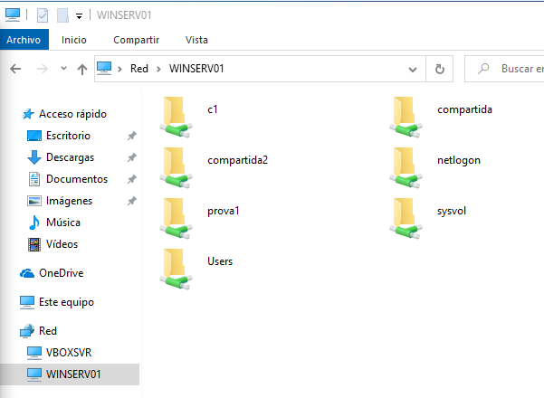
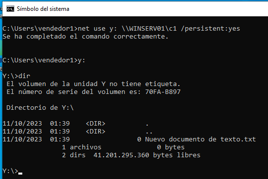
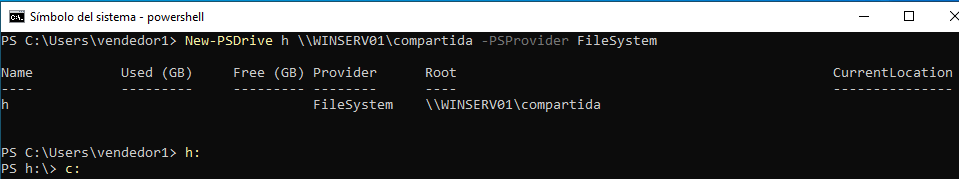
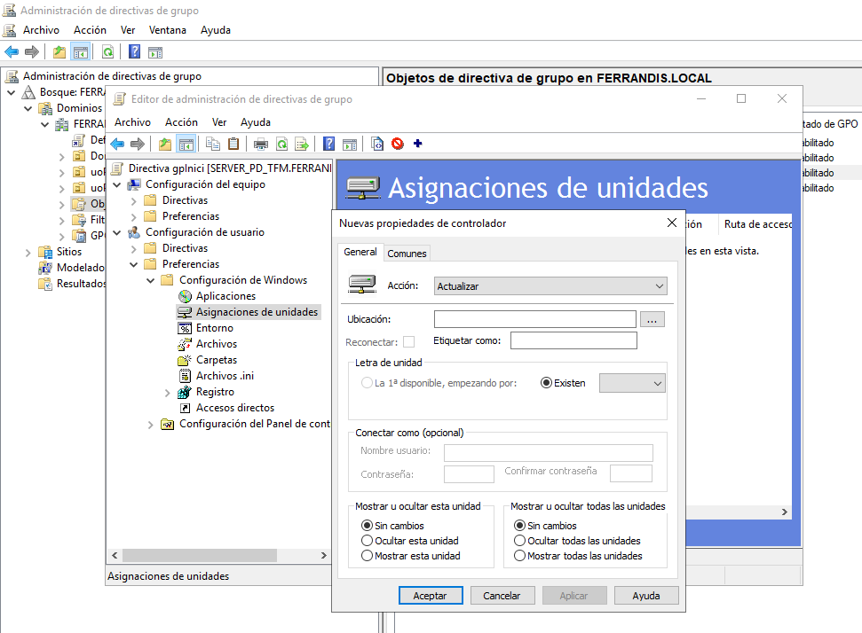

# Captura d'unitats de xarxa

Una de les diferències entre els sistemes de fitxers de Windows i Linux son les assignacion d'unitats ( A: B: C: D: ...) Des del originals floppy disk ( A: B: ...), el primer disc dur ( C: )...

Les "unitats" poden ser:
* Discos sencers
* Particions o volums
* Carpetes compartides
  
Anem a centra-nos en estes últimes. La captura o assignació d'unitats de xarxa té la finalitat de facilitar l'accès a una ruta sense necessitat de saber-se tota la ruta sencera (en Linux podria implementarse amb enllaços simbòlics).
A més, podem tindre un accès homogeni per a totes les màquines i, fins i tot, automatizar-la.

## Net use
Les ordre "net" tenen gran utilitat i poden automatizar-se per a executar-se dins d'un fitxer *.bat* com vorem més avant.

</img>

</img>

El "-persistent" és per assegurar que, en reiniciar el PC, es mantinga la captura.

## Mitjançant POWERSHELL

</img>

## GPO per a capturar unitats de xarxa.

Creem una Directiva de Grup que per a que tots els usuaris, en iniciar sessió al domini, tinguen capturada una unitat de xarxa. D'altra forma caldría usar en "net use" des de cada màquina ( scrpit o bat en l'inici)

</img>

